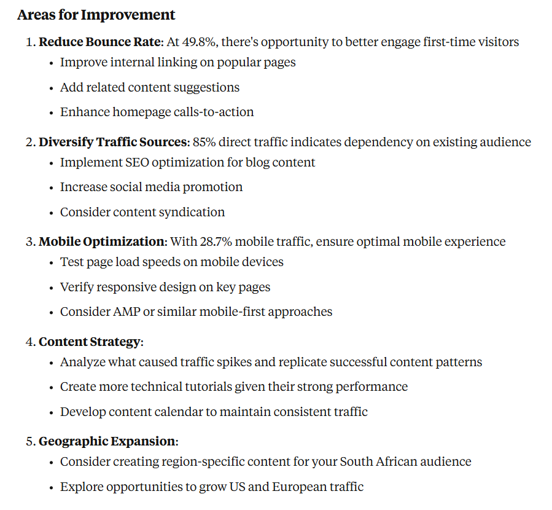

[](https://github.com/Macawls/umami-mcp-server/actions/workflows/test.yml) [](https://github.com/Macawls/umami-mcp-server/actions/workflows/release.yml) [](https://github.com/Macawls/umami-mcp-server/actions/workflows/pages.yml)

# Umami MCP Server

Connect your Umami Analytics to any MCP client - Claude Desktop, VS Code, Cursor, Zed, and more.



## Quick Start

### 1. Download

Get the latest release for your platform from [Releases](https://github.com/Macawls/umami-mcp-server/releases).

### 2. Configure Your MCP Client

<details>
<summary><strong>Claude Desktop</strong></summary>

Add to your Claude Desktop config:

**Windows:** `%APPDATA%\Claude\claude_desktop_config.json`  
**macOS:** `~/Library/Application Support/Claude/claude_desktop_config.json`  
**Linux:** `~/.config/Claude/claude_desktop_config.json`

```json
{
  "mcpServers": {
    "umami": {
      "command": "path/to/umami-mcp",
      "env": {
        "UMAMI_URL": "https://your-umami-instance.com",
        "UMAMI_USERNAME": "your-username",
        "UMAMI_PASSWORD": "your-password"
      }
    }
  }
}
```

Restart Claude Desktop to load the server.

</details>

<details>
<summary><strong>VS Code (Cline)</strong></summary>

Add to your VS Code settings (`Ctrl/Cmd + ,` → Extensions → Cline):

```json
{
  "cline.mcpServers": {
    "umami": {
      "command": "path/to/umami-mcp",
      "env": {
        "UMAMI_URL": "https://your-umami-instance.com",
        "UMAMI_USERNAME": "your-username",
        "UMAMI_PASSWORD": "your-password"
      }
    }
  }
}
```

Or add to `.vscode/settings.json` in your workspace.

</details>

<details>
<summary><strong>Cursor</strong></summary>

1. In Cursor, press `Ctrl/Cmd + Shift + P` to open command palette
2. Search for "Cursor Settings" and select "Cursor Settings: Open User Settings"
3. Navigate to the MCP section
4. Add the Umami server configuration:

```json
{
  "umami": {
    "command": "path/to/umami-mcp",
    "env": {
      "UMAMI_URL": "https://your-umami-instance.com",
      "UMAMI_USERNAME": "your-username",
      "UMAMI_PASSWORD": "your-password"
    }
  }
}
```

The Agent will automatically use the Umami tools when relevant. You can also enable auto-run to skip approval prompts.

</details>

<details>
<summary><strong>Zed</strong></summary>

Add to your Zed settings:

```json
{
  "assistant": {
    "version": "2",
    "mcp_servers": {
      "umami": {
        "command": "path/to/umami-mcp",
        "env": {
          "UMAMI_URL": "https://your-umami-instance.com",
          "UMAMI_USERNAME": "your-username",
          "UMAMI_PASSWORD": "your-password"
        }
      }
    }
  }
}
```

</details>

<details>
<summary><strong>Other MCP Clients</strong></summary>

For any MCP-compatible client, you'll need:

- **Command**: Path to the umami-mcp binary
- **Environment Variables**:
  - `UMAMI_URL`: Your Umami instance URL
  - `UMAMI_USERNAME`: Your username
  - `UMAMI_PASSWORD`: Your password

Check your client's documentation for specific configuration format.

</details>

## Example Prompts

### Analytics & Traffic

- "Give me a comprehensive analytics report for my website over the last 30 days"
- "Which pages are getting the most traffic this month? Show me the top 10"
- "Analyze my website's traffic patterns - when do I get the most visitors?"

### User Insights

- "Where are my visitors coming from? Break it down by country and city"
- "What devices and browsers are my users using?"
- "Show me the user journey - what pages do visitors typically view in sequence?"

### Real-time Monitoring

- "How many people are on my website right now? What pages are they viewing?"
- "Is my website experiencing any issues? Check if traffic has dropped significantly"

### Content & Campaign Analysis

- "Which blog posts should I update? Show me articles with declining traffic"
- "How did my recent email campaign perform? Track visitors from the campaign UTM"
- "Compare traffic from different social media platforms"

## Alternative Configuration

Instead of environment variables, create a `config.yaml` file next to the binary:

```yaml
umami_url: https://your-umami-instance.com
username: your-username
password: your-password
```

Environment variables take priority over the config file. This allows you to override config file settings without modifying the file itself.

## Build from Source

```bash
git clone https://github.com/Macawls/umami-mcp-server.git
cd umami-mcp-server
go build -o umami-mcp
```

## Troubleshooting

### Binary won't run

- **macOS**: Run `xattr -c umami-mcp` to remove quarantine
- **Linux**: Run `chmod +x umami-mcp` to make executable

### Connection errors

- Verify your Umami instance is accessible
- Check your credentials are correct
- Ensure the URL has no trailing slash

### Tools not showing up

- Check your MCP client logs for errors
- Verify the binary path is absolute
- Try running the binary directly to check for errors

## Available Tools

- **get_websites** - List all your websites
- **get_stats** - Get visitor statistics
- **get_pageviews** - View page traffic over time
- **get_metrics** - See browsers, countries, devices, and more
- **get_active** - Current active visitors

## License

MIT
